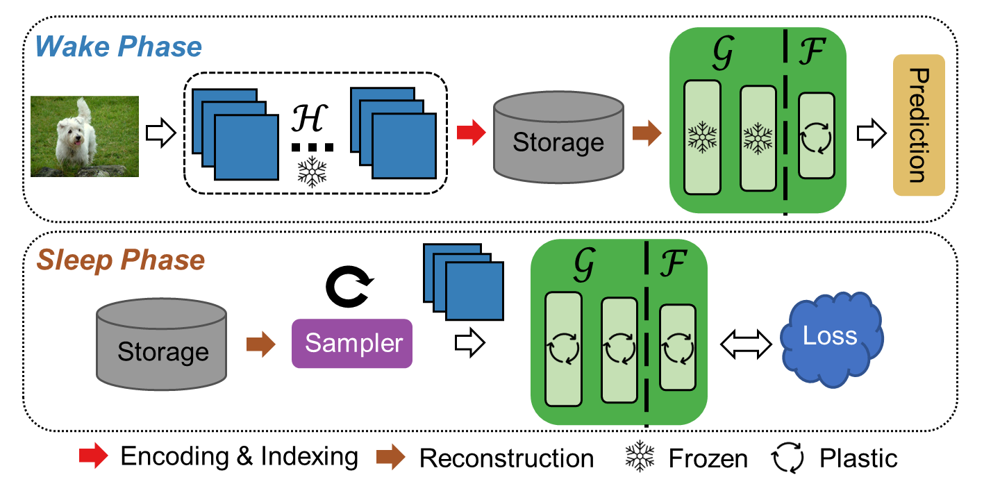

SIESTA: Efficient Online Continual Learning with Sleep
=====================================
This is a PyTorch implementation of the SIESTA algorithm from our paper. An [arXiv pre-print](https://arxiv.org/abs/2303.10725) of our paper is available.




## Citation
If using this code, please cite our paper.
```
@article{yousuf2023siesta,
  title={SIESTA: Efficient Online Continual Learning with Sleep},
  author={Yousuf Harun, Md and Gallardo, Jhair and Hayes, Tyler L and Kemker, Ronald and Kanan, Christopher},
  journal={arXiv e-prints},
  pages={arXiv--2303},
  year={2023}
}
```
